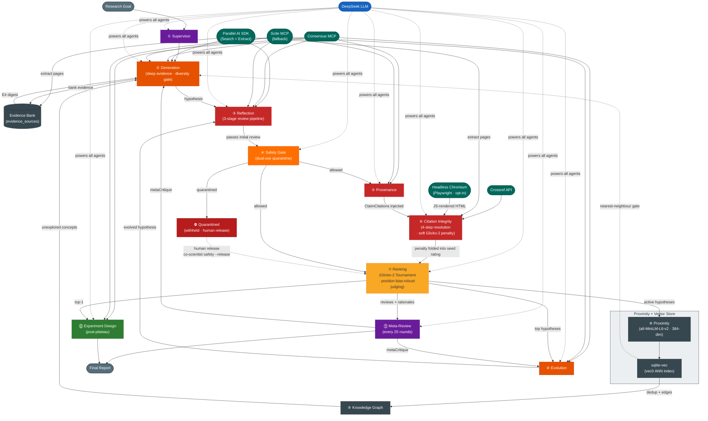

# Co-Scientist

> **Open-source multi-agent AI system for automated scientific hypothesis generation, ranking, and experiment design**  
> Inspired by: *"Accelerating scientific discovery with Co-Scientist"* — Gottweis et al., Nature (2026)

[](https://www.typescriptlang.org/)
[](https://bun.sh/)
[](https://api.deepseek.com)
[](https://github.com/asg017/sqlite-vec)

---

## What is Co-Scientist?

Co-Scientist is a **multi-agent AI system** inspired by the scientific method that autonomously generates, critiques, evolves, and ranks novel research hypotheses. Given a research goal in natural language, it:

1. **Generates** diverse hypotheses via literature search, scientific debates, and assumption chaining — with a save-time near-duplicate gate that rejects converging ideas before they cost anything downstream
2. **Grounds generation in actual sources** — a bounded DeepResearch-style loop (search → plan → read → bank) reads page/paper content before generating hypotheses, with a persistent cited evidence bank per session
3. **Reviews** each hypothesis for novelty, correctness, testability, and safety through a 3-stage pipeline
4. **Tracks provenance** — fact-checks every claim against peer-reviewed literature before a hypothesis enters the tournament
5. **Verifies citation integrity** — checks every cited paper actually exists against Crossref and applies a soft Glicko-2 penalty proportional to the fabrication rate
6. **Screens for dual-use risk** — quarantines hypotheses flagged for bioweapon, chemical-weapon, or human-harm potential before they enter the tournament, with a human-in-the-loop override
7. **Ranks** hypotheses via a Glicko-2 tournament with multi-turn scientific debates and evidence-grounded judging, debiased against LLM position bias
8. **Evolves** top-ranked hypotheses toward higher quality using 6 mutation strategies
9. **Maps** a knowledge graph of concepts and lineage to steer generation toward unexplored areas
10. **Synthesizes** a final research overview and generates a step-by-step experimental protocol for the top hypothesis

---

## Quick Start

### 1. Install Bun

```bash
curl -fsSL https://bun.sh/install | bash
```

### 2. Install dependencies

```bash
git clone https://github.com/raktim-mondol/co-scientist.git
cd co-scientist
bun install
```

### 3. Configure

```bash
cp .env.example .env
```

Edit `.env`:

```env
# Required
DEEPSEEK_API_KEY=your_key_here
PARALLEL_AI_API_KEY=your_token_here

# Optional (defaults shown)
DEEPSEEK_BASE_URL=https://api.deepseek.com
DEEPSEEK_MODEL=deepseek-v4-pro
CONSENSUS_MCP_URL=https://mcp.consensus.app/mcp

# Scite MCP — academic search fallback (OAuth PKCE, no key required)
# SCITE_MCP_URL=https://api.scite.ai/mcp
# SCITE_API_KEY=your_scite_api_key_here     # static key (skips OAuth)
# ACADEMIC_SEARCH_PROVIDERS=consensus,scite  # priority order
# ACADEMIC_SEARCH_MODE=priority              # priority | parallel | fallback

MAX_WORKERS=3
MAX_HYPOTHESES=5
MAX_TOURNAMENT_ROUNDS=100
COMPUTE_BUDGET_TOKENS=500000

# Generation quality (optional) — save-time near-duplicate cosine gate.
# 1 (or >1) disables the gate. Default 0.92 (matches the proximity-dedup threshold).
# GENERATION_DIVERSITY_THRESHOLD=0.92

# Reproducibility (optional) — seeds all scheduling/sampling RNG. Unset = non-deterministic.
# SEED=42

# Citation integrity — headless browser fallback for Cloudflare-blocked URLs (optional)
# Requires: bun add playwright && npx playwright install chromium (~200MB one-time)
# CITATION_HEADLESS_BROWSER=true

# Safety gate — dual-use / biosecurity quarantine (recommended: keep enabled)
# SAFETY_GATE=false                 # disable entirely (not recommended)
# SAFETY_QUARANTINE_THRESHOLD=high  # high (default) | moderate | low
```

### 4. Link globally

```bash
bun link
```

### 5. Run

```bash
# Interactive mode (prompts for research goal) — opens the live TUI on a TTY
co-scientist run

# Or pass goal directly
co-scientist run --goal "What are novel epigenetic mechanisms underlying ALS pathogenesis?"

# With custom budget
co-scientist run --goal "..." --max-hypotheses 20 --budget 100000

# Disable the TUI and use the plain progress output instead
co-scientist run --no-tui --goal "..."
```

---

## CLI Commands

| Command | Description |
|---------|-------------|
| `co-scientist run` | Start a new research session |
| `co-scientist resume <id>` | Resume a paused session |
| `co-scientist list` | List all sessions |
| `co-scientist results <id>` | Show ranked hypotheses |
| `co-scientist results <id> --show-feedback` | Show ranked hypotheses with full RLEF feedback + citation-integrity details |
| `co-scientist overview <id>` | Show final research overview |
| `co-scientist design <id>` | Generate experimental protocol for a hypothesis |
| `co-scientist graph <id>` | Visualise the knowledge graph (text / DOT / JSON) |
| `co-scientist compare <id> <hyp-id-1> <hyp-id-2>` | Run a manual head-to-head match between two hypotheses |
| `co-scientist diff <id> <hyp-id>` | Show lineage tree and field-level diff vs parent |
| `co-scientist feedback <id>` | Submit expert review or hypothesis |
| `co-scientist feedback <id> --experimental` | Submit empirical/experimental feedback (RLEF) · immediate Elo update |
| `co-scientist feedback <id> --review <hyp-id>` | Expert opinion review (archival only, no Elo change) |
| `co-scientist feedback <id> --hypothesis` | Submit your own hypothesis into the tournament |
| `co-scientist safety <id>` | Review quarantined hypotheses (dual-use screen) |
| `co-scientist safety <id> --release <hyp> --reason "..."` | Release a quarantined hypothesis with justification |
| `co-scientist export <id>` | Export to Markdown or JSON |
| `co-scientist delete <id>` | Delete a session and all its data |

---

## Live Interactive TUI

When `co-scientist run` is launched in a real terminal (stdout is a TTY), it automatically activates a full-screen **Ink terminal UI** instead of the plain progress bar.

```
╭─────────────────────────────────────────────────────────────╮
│ co-scientist   sess:883876e2   running   4m 12s             │
│ Goal: What are novel epigenetic mechanisms underlying ALS?  |
|                                                             │
│ Tokens ▓▓▓▓▓░░░░░ 245.3k/500k (49%)   Hyp:8   AvgElo:1284   │
╰─────────────────────────────────────────────────────────────╯
╭───────────────────────────────────────────────────────────── ╮
│   #   Elo   Hypothesis                                       │
│▶  1  1412  ✓ Aberrant R-loop accumulation at TDP-43 loci... │
│   2  1344  ✓ Phase-separated FUS condensates impair spl...   |  
│   3  1298  ⧖ Cryptic exon inclusion via STMN2 silencing...   │
│   4  1201  ✓ m6A hypomethylation destabilises TARDBP mRNA    │
╰───────────────────────────────────────────────────────────── ╯
ticker: + hypothesis #8 added
↑↓ select   [k]ill   [b]oost   [i]nject   [p]ause   [q]uit
```

### Hotkeys

| Key | Action |
|-----|--------|
| `↑` / `↓` | Move selection up/down in the leaderboard |
| `k` | **Kill** — reject the selected hypothesis (confirms with `y`/`n`) |
| `b` | **Boost** — set the selected hypothesis's Elo to an absolute value |
| `i` | **Inject** — type a new hypothesis (title + content) directly into the tournament |
| `p` | **Pause / Resume** — freeze the orchestration loop without losing state |
| `q` | **Quit** — stop the session and save state to SQLite |

### Status glyphs

| Glyph | Meaning |
|-------|---------|
| `✓` | Active — competing in the tournament |
| `⧖` | Pending review or currently under review |
| `✗` | Rejected (killed) |
| `✨` | Evolved from a parent hypothesis |

### Operator steering

- **Kill (`k`)** — marks the hypothesis as `rejected`; the supervisor stops scheduling work on it immediately.
- **Boost (`b`)** — sets an absolute Elo value (e.g. `1500`) via an atomic Glicko-2 write so no concurrent tournament match can clobber it.
- **Inject (`i`)** — inserts a human-authored hypothesis at Elo 1200 with status `pending_review`; it goes through the normal reflection + provenance pipeline before competing. Use Tab to switch between the Title and Content fields.

### Disabling the TUI

```bash
# Plain chalk/ora progress output (also auto-used when stdout is piped)
co-scientist run --no-tui --goal "..."

# Piping stdout always disables TUI automatically
co-scientist run --goal "..." | tee output.log
```

---

## RLEF — Reinforcement Learning from Experimental Feedback

Co-Scientist can close the loop with real-world empirical results. After running a wet-lab experiment, ML training run, or user study, submit the outcome as feedback. The system automatically:

1. **Extracts a reward signal** (−1 to +1) from free-text + optional N/C/T scores
2. **Updates the hypothesis Elo rating** using K=48 (higher weight than LLM debates)
3. **Injects validated/refuted hypotheses** into generation, reflection, and evolution prompts for in-session learning
4. **Stores strong-signal feedback** in a cross-session semantic memory so future sessions on related goals benefit from past experiments

### Feedback modes

There are three ways to submit feedback, each with different effects:

#### `--experimental` — Empirical result (RLEF) · *immediate effect*

```bash
co-scientist feedback <session-id> --experimental
```

The most actionable mode. When you submit empirical feedback:

- Calculates a reward signal from your text + N/C/T scores
- **Immediately updates the hypothesis Elo rating** (K=48 — higher weight than tournament debates)
- Rankings change right away — visible with `co-scientist results <session-id>`
- Strong signals (|reward| > 0.3) are stored in cross-session memory so future sessions on related goals benefit

You will be prompted for:
- **Hypothesis ID** — from `co-scientist results <session-id>`
- **Empirical feedback** — free-text observation (paste and press Enter)
- **Novelty / Correctness / Testability scores** — 0–10, optional (press Enter to skip)
- **Summary** — optional one-liner (press Enter to skip)

The computed reward and new Elo are displayed immediately. No re-run required.

#### `--review` — Expert opinion · *archival only*

```bash
co-scientist feedback <session-id> --review <hypothesis-id>
```

Saves your expert verdict (`pass` / `fail` / `uncertain`) and N/C/T scores to the `reviews` table alongside the automated tournament results. **Does not change Elo or rankings.** Purely for record-keeping — a human expert's opinion stored for reference.

#### `--hypothesis` — Expert submission · *enters tournament*

```bash
co-scientist feedback <session-id> --hypothesis
```

Inserts your own hypothesis into the session at Elo 1200.

- **Session still running** → it will automatically compete in future tournament rounds against AI-generated hypotheses.
- **Session completed** → stored in the database as an entry but won't be evaluated further unless the session is resumed.

### Viewing feedback

```bash
# Summary line per hypothesis (count + avg reward + latest snippet)
co-scientist results <session-id>

# Full per-entry detail (reward, N/C/T scores, recorder, date)
co-scientist results <session-id> --show-feedback
```

### Domain examples

**Biology — IC₅₀ / wet-lab result**
```
Feedback text : Drug X reduces MDA-MB-231 tumor volume by 47% (p<0.01) at 10 nM.
                IC50 confirmed at 8.3 nM. Apoptosis confirmed via Annexin V staining.
Novelty       : 8
Correctness   : 9
Testability   : 8
Metadata JSON : {"cellLine":"MDA-MB-231","IC50_nM":8.3,"assay":"Annexin-V"}
```

**Machine Learning — model performance**
```
Feedback text : ResNet-50 fine-tuned with proposed augmentation strategy achieves
                94.2% top-1 accuracy on CIFAR-10, +3.1pp over baseline.
Novelty       : 7
Correctness   : 9
Testability   : 9
Metadata JSON : {"model":"ResNet-50","dataset":"CIFAR-10","accuracy":0.942,"baseline":0.911}
```

**User Studies — interview insights**
```
Feedback text : 12/15 participants found the proposed onboarding flow significantly
                clearer. Task completion time reduced by 34%. Hypothesis confirmed.
Novelty       : 6
Correctness   : 8
Testability   : 7
Metadata JSON : {"n":15,"task_completion_improvement_pct":34,"method":"think-aloud"}
```

### How reward extraction works

```
sentiment  = keyword-based sentiment score of feedback text   // −1 to +1
scoreAvg   = (novelty + correctness + testability) / 30 − 1  // normalise to [−1, +1]
reward     = 0.4 × sentiment + 0.6 × scoreAvg                // scores weighted higher
```

When N/C/T scores are omitted, reward falls back to pure sentiment. The reward is then applied to the hypothesis Elo:

```
newElo = currentElo + 48 × ((reward + 1) / 2 − 0.5)
```

K=48 is intentionally higher than tournament debate K=16–32 because empirical results outweigh LLM-simulated debates.

---

## Deep Evidence Pipeline

The `literature_exploration` generation strategy no longer relies solely on search-result snippets. A new **LiteratureResearchAgent** runs a bounded DeepResearch-style loop (search → plan → read → bank) that:

1. **Searches** via the existing `SearchTool.multiSearch` (Parallel AI + Consensus)
2. **Plans** each round with an LLM call that decides sufficiency, picks sources to read, and proposes new queries
3. **Reads** actual page/paper content via the `parallel-web` SDK (Search + Extract)
4. **Banks** goal-directed extractions (`{rationale, evidence, summary}`) in a `evidence_sources` table with a summary embedding

Generation prompts receive a numbered `[E#]` evidence digest with source URLs, and citations map back through those markers. Every failure path falls back silently to the existing snippet-based behavior.

**Config** (in `.env`):

| Variable | Default | Description |
|----------|---------|-------------|
| `DEEP_RESEARCH_MAX_ROUNDS` | 2 | Loop rounds (0 disables the pipeline) |
| `DEEP_RESEARCH_URLS_PER_ROUND` | 3 | URLs to read per round |
| `DEEP_RESEARCH_MAX_CONTENT_CHARS` | 40000 | Max chars per page sent to extractor |

---

## Scite MCP — Academic Search Fallback

Co-Scientist uses **Consensus** as the primary academic search provider, but automatically falls back to **Scite** — a citation intelligence platform that indexes 1.2B+ citation statements and classifies them as supporting, mentioning, or contrasting. If Consensus is unreachable or returns no results, Scite takes over transparently so academic search never fails hard.

### How the fallback works

By default, academic search providers are tried in **priority order**: Consensus first, Scite as fallback. This is controlled by two env vars:

| Variable | Default | Description |
|----------|---------|-------------|
| `ACADEMIC_SEARCH_PROVIDERS` | `consensus,scite` | Comma-separated provider list, tried in order |
| `ACADEMIC_SEARCH_MODE` | `priority` | Execution mode: `priority`, `parallel`, or `fallback` |

**Execution modes:**

| Mode | Behaviour |
|------|-----------|
| `priority` | Try providers in order — first success wins. Consensus first, Scite only if Consensus fails. |
| `parallel` | Call all configured providers simultaneously and merge results — more comprehensive but uses more tokens. |
| `fallback` | Try the first provider; only use the next if the first returns **zero results** or errors. |

### Authentication

Scite uses **OAuth 2.0 PKCE** — the same browser-based flow as Consensus:

1. On first run, a browser window opens for Scite authorization.
2. After you approve, tokens are cached at `~/.co-scientist/scite-oauth.json`.
3. On subsequent runs, cached tokens are used and auto-refreshed when expired.

No manual key management needed. If you have a paid Scite API key, set `SCITE_API_KEY` in `.env` to skip the OAuth flow entirely:

```env
SCITE_API_KEY=your_scite_api_key_here
```

### Provider configuration examples

```env
# Consensus only (no fallback)
ACADEMIC_SEARCH_PROVIDERS=consensus

# Scite only
ACADEMIC_SEARCH_PROVIDERS=scite

# Scite first, Consensus as fallback
ACADEMIC_SEARCH_PROVIDERS=scite,consensus

# Call both simultaneously for comprehensive coverage
ACADEMIC_SEARCH_MODE=parallel
```

### Scite vs. Consensus

| Feature | Consensus | Scite |
|---------|-----------|-------|
| **Focus** | Peer-reviewed papers with consensus analysis | Citation intelligence — supporting/contrasting statements |
| **Coverage** | 200M+ papers, semantic search | 1.2B+ citation statements, Smart Citations |
| **Best for** | Finding consensus on a research question | Understanding how a paper has been cited (supported/refuted) |
| **Auth** | OAuth 2.1 PKCE | OAuth 2.0 PKCE |
| **Role** | Primary academic search | Fallback / complementary |

---

## Diversity-Aware Generation

Mode collapse — many near-identical hypotheses crowding out genuinely distinct ideas — wastes budget and skews the tournament. `ProximityAgent` catches duplicates, but only *after* a hypothesis has been saved, reviewed, provenance-checked, and citation-verified. Diversity-aware generation adds an **early, save-time gate** so converging ideas are discarded before they cost anything downstream.

Inside `GenerationAgent`, before a new hypothesis is persisted:

1. The candidate is embedded locally (`all-MiniLM-L6-v2`, same `${title}. ${summary}` text shape `ProximityAgent` uses — no API tokens).
2. The existing sqlite-vec ANN index returns its nearest neighbours, which are then **exact-cosine re-scored** against same-session, non-rejected hypotheses.
3. If the nearest neighbour is ≥ the threshold (default **0.92**), the candidate is **discarded** — no save, no review, no provenance, no seeding.
4. Otherwise it is saved and its embedding is persisted, so the next gate and `ProximityAgent` reuse it (no double-embedding).

In addition, the `literature_exploration` strategy is **proactively steered**: the titles/summaries of existing hypotheses are injected into the prompt with an instruction to propose a *mechanistically distinct* idea, nudging generation away from occupied regions of embedding space.

This is **complementary** to `ProximityAgent`, not a replacement — proximity still owns the inter-hypothesis graph (`proximity_edges`) and post-hoc dedup, and still catches duplicates that bypass this gate (evolution, expert injection).

```env
# Save-time near-duplicate cosine threshold (default 0.92). 1 (or >1) disables the gate.
GENERATION_DIVERSITY_THRESHOLD=0.92
```

---

## Citation Integrity

Provenance checks whether a hypothesis's *claims are supported*. Citation integrity is a separate, complementary check: it verifies that every cited paper **actually exists** — catching LLM-fabricated references (hallucinated DOIs and invented titles) before they lend false credibility to a hypothesis.

After provenance, the **Citation-Integrity agent** resolves each citation through a cascading multi-step pipeline:

```
Citation string
       │
       ▼
  ┌─────────┐    DOI found?    ┌──────────────┐
  │ Step 1  │────────────────▶│ Crossref API  │──▶ verified / fabricated / unverified
  │ Regex   │                  └──────────────┘
  │ extract │
  └────┬────┘   no DOI, but URL?
       │
       ▼
  ┌─────────┐    DOI in meta?   ┌──────────────┐
  │ Step 2a │────────────────▶│ Crossref API  │──▶ verified / unverified (page-sourced)
  │ Raw     │    (citation_doi, └──────────────┘
  │ fetch() │     dc.identifier,
  │ + HTML  │     JSON-LD, body)
  │ parse   │
  └────┬────┘   raw fetch blocked (Cloudflare/SPA)?
       │
       ▼
  ┌─────────┐    DOI in output? ┌──────────────┐
  │ Step 2b │────────────────▶│ Crossref API  │──▶ verified / unverified (page-sourced)
  │ Parallel│    (JS-rendered   └──────────────┘
  │ AI      │     extract)
  │ extract │
  └────┬────┘   Parallel AI also blocked / unavailable?
       │
       ▼
  ┌─────────┐    DOI in HTML?   ┌──────────────┐
  │ Step 2c │────────────────▶│ Crossref API  │──▶ verified / unverified (page-sourced)
  │ Headless│    (opt-in,       └──────────────┘
  │ Chromium│     full JS exec)
  │(Playwright)
  └────┬────┘   no URL, or all URL steps failed?
       │
       ▼
  ┌─────────┐   title match?   ┌──────────────┐
  │ Step 3  │────────────────▶│ Crossref API  │──▶ verified (Dice ≥ 0.7) / unverified
  │ Crossref│    bibliographic  └──────────────┘
  │ title   │    search
  │ search  │
  └─────────┘
```

| Step | Method | What it handles |
|------|--------|-----------------|
| **1** | DOI extracted directly from the citation string | Bare DOIs (`10.1038/abc`), DOI URLs (`doi.org/10.1038/abc`), DOIs embedded in publisher URLs |
| **2a** | Raw `fetch()` the URL, parse HTML for `citation_doi` / `dc.identifier` / JSON-LD / body regex | Publisher pages with server-rendered metadata (Nature, PMC, Science) |
| **2b** | Parallel AI `/v1/extract` (JS-rendered extract) | Cloudflare JS challenges, SPA-rendered pages (requires `PARALLEL_AI_API_KEY`) |
| **2c** | Headless Chromium via Playwright (opt-in) | Cloudflare-protected pages when Parallel AI is unavailable or also blocked |
| **3** | Crossref bibliographic title search | Free-text citations with no DOI or URL |

The extracted DOI is resolved against the [Crossref REST API](https://api.crossref.org) (no auth required) and classified:

| Status | Meaning |
|--------|---------|
| ✅ `verified` | DOI resolves, or a free-text citation matches a real paper title (token-set Dice ≥ 0.7) |
| ⚠️ `unverified` | No confident match, DOI extracted from a page but not in Crossref, or network failures (fails safe) |
| ❌ `fabricated` | **User-provided** DOI returns 404 — the paper does not exist. Only applies to DOIs the user typed directly. |

> **Important:** DOIs extracted from fetched pages (Steps 2a/2b/2c) that 404 on Crossref are marked **unverified**, not fabricated. A real publisher page containing a DOI-like identifier isn't fabrication — it's just not in Crossref (e.g., DataCite DOIs, non-DOI strings matching the regex).

### Headless browser fallback (Step 2c)

Many major academic publishers (Oxford Academic, Frontiers) protect their pages with Cloudflare JS challenges that block plain `fetch()`. When both raw fetch and Parallel AI extract fail, an optional **headless Chromium** can render the page with full JavaScript execution.

> **This is optional.** If you don't install it, Step 2c is simply skipped — citation verification still works through Steps 1–3. Only URLs behind Cloudflare JS challenges will remain unverified.

#### Installation

The `playwright` npm package is already in `package.json` and installed with `bun install`. You only need to download the Chromium browser binary (~200MB, one-time):

```bash
npx playwright install chromium
```

#### Enable

```bash
# Add to .env
CITATION_HEADLESS_BROWSER=true
```

#### Verify it's working

```bash
bun run -e "
import { fetchWithHeadlessBrowser } from './src/tools/headlessResolver.js';
const html = await fetchWithHeadlessBrowser('https://academic.oup.com/bioinformatics/article/39/7/btad410/7208864');
console.log(html ? '✅ Headless browser working — got ' + html.length + ' chars' : '❌ Failed');
"
```

Playwright is lazy-loaded — zero startup cost unless Step 2c is actually triggered. It can handle non-interactive Cloudflare Turnstile challenges (JS execution + browser fingerprint) but cannot solve interactive CAPTCHAs (reCAPTCHA v2 checkbox, hCaptcha). Most academic publisher pages use only the non-interactive type.

### Soft Glicko-2 penalty

Results are persisted to a `citation_verifications` table and folded into the hypothesis's seed rating via a **soft penalty** proportional to the weighted fabrication rate:

```
f          = (fabricated + 0.5 × unverified) / total       // 0..1, weighted rate
ratingDelta = −round(f × 150)                               // up to −150 Elo
rdDelta     = +round(f × 100)                               // up to +100 RD (more uncertainty)
```

The penalty is *soft* (proportional, not a hard reject) and widens the rating deviation so the tournament can still re-evaluate the hypothesis on its merits. A hypothesis with no citations is never penalised.

### Viewing citation integrity

```bash
# Per-hypothesis summary line (verified · unverified · fabricated), fabricated entries listed
co-scientist results <session-id> --show-feedback

# Markdown export annotates each citation; JSON export includes full citationVerifications
co-scientist export <session-id>
```

---

## Safety Gate — Dual-Use & Biosecurity Quarantine

Not every scientifically valid hypothesis is safe to pursue. Co-Scientist includes a dedicated **SafetyAgent** that screens every hypothesis for dual-use, biosecurity, and human-harm risk **after the initial review but before the tournament** — so hazardous ideas never compete for ranking or receive experimental protocols.

### How it works

After a hypothesis passes the initial review (novelty/correctness check), the safety gate intercepts it:

1. The **SafetyAgent** sends the hypothesis title, content, rationale, key assumptions, and experimental plan to the LLM with a dedicated safety-review prompt
2. The LLM classifies the hypothesis into one of four severity levels:
   | Severity | Meaning |
   |----------|---------|
   | `none` | No meaningful misuse or harm potential |
   | `low` | Sensitive area but minimal actionable uplift |
   | `moderate` | Plausible misuse pathway or non-trivial harm potential |
   | `high` | Clear, actionable uplift toward serious harm or a weapon |
3. If the assessed severity meets or exceeds the configured **quarantine threshold**, the hypothesis status is set to `quarantined` — it is withheld from provenance, citation verification, tournament seeding, and everything downstream
4. If the severity is below the threshold, the hypothesis proceeds normally

A prior `safetyFlag` from the initial review acts as a floor: if a reviewer raised a safety concern but the dedicated screen returned `none`, the severity is lifted to at least `low` so no upstream signal is silently dropped.

### Configuration

| Variable | Default | Description |
|----------|---------|-------------|
| `SAFETY_GATE` | `true` | Set to `false` to disable the safety gate entirely (not recommended) |
| `SAFETY_QUARANTINE_THRESHOLD` | `high` | Severity at which hypotheses are quarantined: `high`, `moderate`, or `low` |

```env
# Disable the safety gate entirely (not recommended):
# SAFETY_GATE=false

# Quarantine threshold:
#   high     — only clearly actionable weapons-uplift (default)
#   moderate — also quarantine plausible misuse pathways
#   low      — quarantine any sensitive-area hypothesis (higher false-positive rate)
# SAFETY_QUARANTINE_THRESHOLD=high
```

### Reviewing and releasing quarantined hypotheses

The safety gate is a **human-in-the-loop** system — quarantined hypotheses can be reviewed and released by an operator:

```bash
# List all quarantined hypotheses with severity, category, and reasoning
co-scientist safety <session-id>

# Release a specific hypothesis with a required justification
co-scientist safety <session-id> --release <hypothesis-id> --reason "Defensive research with no actionable uplift to harm"
```

Released hypotheses re-enter the active pool and will compete in future tournament rounds if the session is resumed. Each release is recorded with who authorised it, when, and why.

### Example output

```
🛡  Safety Gate — ALS Epigenetics Research

2 hypothesis(es) withheld for safety review:

──────────────────────────────────────────────────────────────────────

[HIGH] CRISPR-based enhancer silencing for TDP-43 knockdown
   ID: abc123
   Category: dual_use  (threshold: high)
   This hypothesis describes a method to silence gene expression via...
   Release: co-scientist safety sess-abc --release abc123 --reason "<justification>"
──────────────────────────────────────────────────────────────────────

[LOW] m6A methylation profiling of ALS patient samples
   ID: def456
   Category: dual_use  (threshold: high)
   Sensitive area but the specific method described is standard...
   Release: co-scientist safety sess-abc --release def456 --reason "<justification>"
──────────────────────────────────────────────────────────────────────

Releasing a hypothesis overrides the safety gate. Review each one carefully.
```

### Design rationale

The safety gate is deliberately placed **after initial review but before provenance and citation verification** — it saves compute by screening early, but still requires the hypothesis to pass novelty/correctness first so we don't waste safety-review tokens on clearly invalid ideas. The gate defaults to `high` (only quarantine the most clearly dangerous hypotheses) to minimise false positives while still catching the worst cases.

---

## Position-Bias-Robust Judging

LLM-as-judge exhibits **position bias** — a systematic preference for whichever candidate is shown first. In the tournament this is compounded because the matchup selector always places the higher-priority hypothesis in slot "A". The Ranking agent controls for this:

- **Simple matches** (cheap) → **swap-and-average**: the pair is judged in both `A,B` and `B,A` orderings. A verdict that flips with order is downgraded to a **draw** (it was position-dependent, not substantive).
- **Debate matches** (3 expensive reasoning calls) → a single **seeded-random** orientation, so the systematic slot-A advantage is removed across the tournament without doubling cost.

The reconciled winner is always reported in real A/B terms, with the presentation order recorded in the match rationale.

---

## Reproducibility

Set a seed to make all scheduling and sampling decisions deterministic:

```bash
co-scientist run --seed 42 --goal "..."
# or via env
SEED=42 co-scientist run --goal "..."
```

A seed makes the seeded RNG (`src/util/rng.ts`, mulberry32) drive every `rng()` call — matchup selection, debate orientation, evolution parent picks, etc. With no seed, `rng()` transparently falls back to `Math.random()` so normal runs are unaffected.

> **Note:** deterministic scheduling is necessary but not sufficient for byte-for-byte replay — LLM outputs are also non-deterministic, and with `MAX_WORKERS > 1` task-completion order varies. For stricter determinism, add `--max-workers 1`.

---

## Development

```bash
bun run src/cli/index.ts   # Run directly — no build step needed
bun test                   # Run tests
bun run src/db/migrate.ts  # Initialise / migrate the database
```

### macOS note

`bun:sqlite` on macOS uses Apple's bundled SQLite which disables extension loading (required for `sqlite-vec`). Add this before opening the DB:

```ts
import { Database } from "bun:sqlite";
Database.setCustomSQLite("/usr/local/opt/sqlite3/lib/libsqlite3.dylib");
```

On Linux this is not needed.

---

## Architecture



---

## Compute Budget

| CLI Flag | Env Var | Default | Description |
|----------|---------|---------|-------------|
| _(none)_ | `MAX_WORKERS` | `3` | Parallel agent workers |
| `--max-hypotheses <n>` | `MAX_HYPOTHESES` | `5` | Hard cap on total hypotheses generated |
| `--max-rounds <n>` | `MAX_TOURNAMENT_ROUNDS` | `100` | Maximum orchestration rounds |
| `--budget <tokens>` | `COMPUTE_BUDGET_TOKENS` | `500000` | Token budget (0 = unlimited) |
| `--seed <n>` | `SEED` | _(unset)_ | Seed scheduling/sampling RNG for reproducible runs |

**Estimated cost** (DeepSeek-v4-pro): A typical 50-hypothesis run uses ~200k–400k tokens (~$0.50–$2.00).

---

## Prompt Customization

All prompts are Handlebars YAML templates in `src/prompts/`. Edit them without any rebuild:

```
src/prompts/
├── supervisor/parse_goal.yaml
├── generation/ (5 templates — 4 strategies + query helper)
├── reflection/ (6 templates)
├── ranking/ (2 templates)
├── evolution/ (6 templates)
├── meta_review/ (2 templates)
└── experiment_design/protocol.yaml
```

---

## Citation

```bibtex
@article{gottweis2026coscientist,
  title={Accelerating scientific discovery with Co-Scientist},
  author={Gottweis, Juraj and Weng, Wei-Hung and others},
  journal={Nature},
  doi={10.1038/s41586-026-10644-y},
  year={2026}
}
```

```bibtex
@software{mondol2026coscientist,
  author = {Mondol, Raktim},
  title  = {Co-Scientist: Open-source multi-agent AI for scientific hypothesis generation},
  url    = {https://github.com/raktim-mondol/co-scientist},
  year   = {2026}
}
```

---

## License

MIT License — see [LICENSE](LICENSE)
