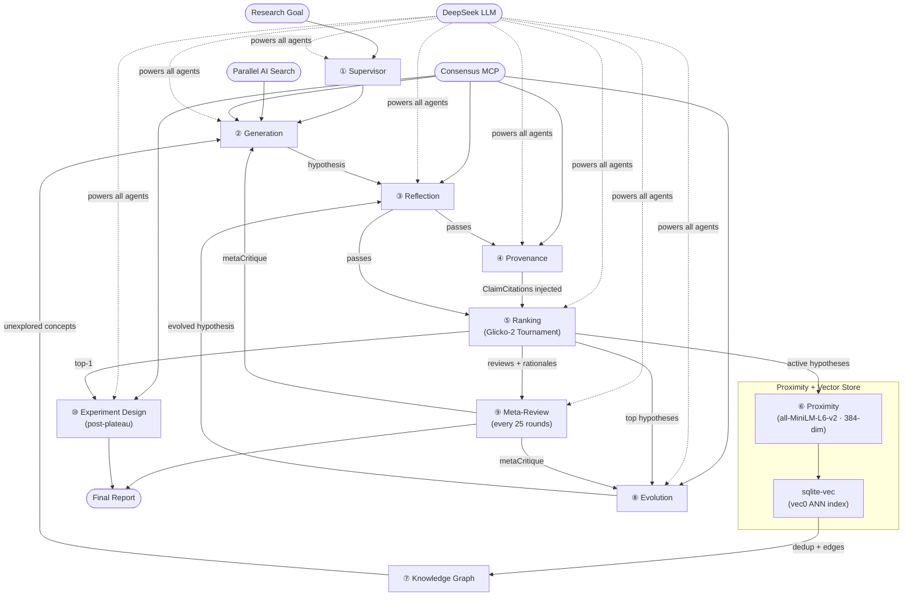

# Co-Scientist

> **Open-source multi-agent AI system for automated scientific hypothesis generation, ranking, and experiment design**  
> Inspired by: *"Accelerating scientific discovery with Co-Scientist"* — Gottweis et al., Nature (2026)

[](https://www.typescriptlang.org/)
[](https://bun.sh/)
[](https://api.deepseek.com)
[](https://github.com/asg017/sqlite-vec)

---

## What is Co-Scientist?

Co-Scientist is a **multi-agent AI system** inspired by the scientific method that autonomously generates, critiques, evolves, and ranks novel research hypotheses. Given a research goal in natural language, it:

1. **Generates** diverse hypotheses via literature search, scientific debates, and assumption chaining
2. **Reviews** each hypothesis for novelty, correctness, testability, and safety through a 3-stage pipeline
3. **Tracks provenance** — fact-checks every claim against peer-reviewed literature before a hypothesis enters the tournament
4. **Ranks** hypotheses via a Glicko-2 tournament with multi-turn scientific debates and evidence-grounded judging
5. **Evolves** top-ranked hypotheses toward higher quality using 6 mutation strategies
6. **Maps** a knowledge graph of concepts and lineage to steer generation toward unexplored areas
7. **Synthesizes** a final research overview and generates a step-by-step experimental protocol for the top hypothesis

---

## Quick Start

### 1. Install Bun

```bash
curl -fsSL https://bun.sh/install | bash
```

### 2. Install dependencies

```bash
git clone https://github.com/raktim-mondol/co-scientist.git
cd co-scientist
bun install
```

### 3. Configure

```bash
cp .env.example .env
```

Edit `.env`:

```env
# Required
DEEPSEEK_API_KEY=your_key_here
PARALLEL_AI_API_KEY=your_token_here

# Optional (defaults shown)
DEEPSEEK_BASE_URL=https://api.deepseek.com
DEEPSEEK_MODEL=deepseek-v4-pro
CONSENSUS_MCP_URL=https://mcp.consensus.app/mcp
MAX_WORKERS=3
MAX_HYPOTHESES=5
MAX_TOURNAMENT_ROUNDS=100
COMPUTE_BUDGET_TOKENS=500000
```

### 4. Link globally

```bash
bun link
```

### 5. Run

```bash
# Interactive mode (prompts for research goal)
co-scientist run

# Or pass goal directly
co-scientist run --goal "What are novel epigenetic mechanisms underlying ALS pathogenesis?"

# With custom budget
co-scientist run --goal "..." --max-hypotheses 20 --budget 100000
```

---

## CLI Commands

| Command | Description |
|---------|-------------|
| `co-scientist run` | Start a new research session |
| `co-scientist resume <id>` | Resume a paused session |
| `co-scientist list` | List all sessions |
| `co-scientist results <id>` | Show ranked hypotheses |
| `co-scientist overview <id>` | Show final research overview |
| `co-scientist design <id>` | Generate experimental protocol for a hypothesis |
| `co-scientist graph <id>` | Visualise the knowledge graph (text / DOT / JSON) |
| `co-scientist compare <id> <hyp-id-1> <hyp-id-2>` | Run a manual head-to-head match between two hypotheses |
| `co-scientist diff <id> <hyp-id>` | Show lineage tree and field-level diff vs parent |
| `co-scientist feedback <id>` | Submit expert review or hypothesis |
| `co-scientist export <id>` | Export to Markdown or JSON |
| `co-scientist delete <id>` | Delete a session and all its data |

---

## Development

```bash
bun run src/cli/index.ts   # Run directly — no build step needed
bun test                   # Run tests
bun run src/db/migrate.ts  # Initialise / migrate the database
```

### macOS note

`bun:sqlite` on macOS uses Apple's bundled SQLite which disables extension loading (required for `sqlite-vec`). Add this before opening the DB:

```ts
import { Database } from "bun:sqlite";
Database.setCustomSQLite("/usr/local/opt/sqlite3/lib/libsqlite3.dylib");
```

On Linux this is not needed.

---

## Architecture



---

## Compute Budget

| CLI Flag | Env Var | Default | Description |
|----------|---------|---------|-------------|
| _(none)_ | `MAX_WORKERS` | `3` | Parallel agent workers |
| `--max-hypotheses <n>` | `MAX_HYPOTHESES` | `5` | Hard cap on total hypotheses generated |
| `--max-rounds <n>` | `MAX_TOURNAMENT_ROUNDS` | `100` | Maximum orchestration rounds |
| `--budget <tokens>` | `COMPUTE_BUDGET_TOKENS` | `500000` | Token budget (0 = unlimited) |

**Estimated cost** (DeepSeek-v4-pro): A typical 50-hypothesis run uses ~200k–400k tokens (~$0.50–$2.00).

---

## Prompt Customization

All prompts are Handlebars YAML templates in `src/prompts/`. Edit them without any rebuild:

```
src/prompts/
├── supervisor/parse_goal.yaml
├── generation/ (4 templates)
├── reflection/ (6 templates)
├── ranking/ (2 templates)
├── evolution/ (5 templates)
├── meta_review/ (2 templates)
└── experiment_design/protocol.yaml
```

---

## Citation

```bibtex
@article{gottweis2026coscientist,
  title={Accelerating scientific discovery with Co-Scientist},
  author={Gottweis, Juraj and Weng, Wei-Hung and others},
  journal={Nature},
  doi={10.1038/s41586-026-10644-y},
  year={2026}
}
```

```bibtex
@software{mondol2025coscientist,
  author = {Mondol, Raktim},
  title  = {Co-Scientist: Open-source multi-agent AI for scientific hypothesis generation},
  url    = {https://github.com/raktim-mondol/co-scientist},
  year   = {2025}
}
```

---

## License

MIT License — see [LICENSE](LICENSE)
