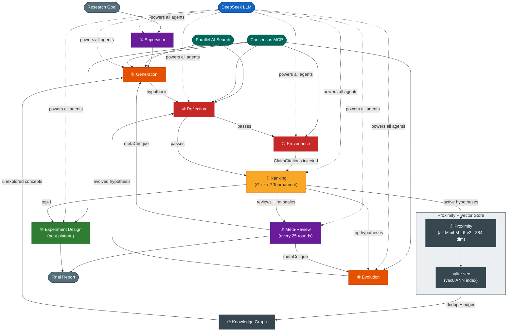

# Co-Scientist

> **Open-source multi-agent AI system for automated scientific hypothesis generation, ranking, and experiment design**  
> Inspired by: *"Accelerating scientific discovery with Co-Scientist"* — Gottweis et al., Nature (2026)

[](https://www.typescriptlang.org/)
[](https://bun.sh/)
[](https://api.deepseek.com)
[](https://github.com/asg017/sqlite-vec)

---

## What is Co-Scientist?

Co-Scientist is a **multi-agent AI system** inspired by the scientific method that autonomously generates, critiques, evolves, and ranks novel research hypotheses. Given a research goal in natural language, it:

1. **Generates** diverse hypotheses via literature search, scientific debates, and assumption chaining
2. **Reviews** each hypothesis for novelty, correctness, testability, and safety through a 3-stage pipeline
3. **Tracks provenance** — fact-checks every claim against peer-reviewed literature before a hypothesis enters the tournament
4. **Ranks** hypotheses via a Glicko-2 tournament with multi-turn scientific debates and evidence-grounded judging
5. **Evolves** top-ranked hypotheses toward higher quality using 6 mutation strategies
6. **Maps** a knowledge graph of concepts and lineage to steer generation toward unexplored areas
7. **Synthesizes** a final research overview and generates a step-by-step experimental protocol for the top hypothesis

---

## Quick Start

### 1. Install Bun

```bash
curl -fsSL https://bun.sh/install | bash
```

### 2. Install dependencies

```bash
git clone https://github.com/raktim-mondol/co-scientist.git
cd co-scientist
bun install
```

### 3. Configure

```bash
cp .env.example .env
```

Edit `.env`:

```env
# Required
DEEPSEEK_API_KEY=your_key_here
PARALLEL_AI_API_KEY=your_token_here

# Optional (defaults shown)
DEEPSEEK_BASE_URL=https://api.deepseek.com
DEEPSEEK_MODEL=deepseek-v4-pro
CONSENSUS_MCP_URL=https://mcp.consensus.app/mcp
MAX_WORKERS=3
MAX_HYPOTHESES=5
MAX_TOURNAMENT_ROUNDS=100
COMPUTE_BUDGET_TOKENS=500000
```

### 4. Link globally

```bash
bun link
```

### 5. Run

```bash
# Interactive mode (prompts for research goal) — opens the live TUI on a TTY
co-scientist run

# Or pass goal directly
co-scientist run --goal "What are novel epigenetic mechanisms underlying ALS pathogenesis?"

# With custom budget
co-scientist run --goal "..." --max-hypotheses 20 --budget 100000

# Disable the TUI and use the plain progress output instead
co-scientist run --no-tui --goal "..."
```

---

## CLI Commands

| Command | Description |
|---------|-------------|
| `co-scientist run` | Start a new research session |
| `co-scientist resume <id>` | Resume a paused session |
| `co-scientist list` | List all sessions |
| `co-scientist results <id>` | Show ranked hypotheses |
| `co-scientist results <id> --show-feedback` | Show ranked hypotheses with full RLEF feedback details |
| `co-scientist overview <id>` | Show final research overview |
| `co-scientist design <id>` | Generate experimental protocol for a hypothesis |
| `co-scientist graph <id>` | Visualise the knowledge graph (text / DOT / JSON) |
| `co-scientist compare <id> <hyp-id-1> <hyp-id-2>` | Run a manual head-to-head match between two hypotheses |
| `co-scientist diff <id> <hyp-id>` | Show lineage tree and field-level diff vs parent |
| `co-scientist feedback <id>` | Submit expert review or hypothesis |
| `co-scientist feedback <id> --experimental` | Submit empirical/experimental feedback (RLEF) · immediate Elo update |
| `co-scientist feedback <id> --review <hyp-id>` | Expert opinion review (archival only, no Elo change) |
| `co-scientist feedback <id> --hypothesis` | Submit your own hypothesis into the tournament |
| `co-scientist export <id>` | Export to Markdown or JSON |
| `co-scientist delete <id>` | Delete a session and all its data |

---

## Live Interactive TUI

When `co-scientist run` is launched in a real terminal (stdout is a TTY), it automatically activates a full-screen **Ink terminal UI** instead of the plain progress bar.

```
╭─────────────────────────────────────────────────────────────╮
│ co-scientist   sess:883876e2   running   4m 12s             │
│ Goal: What are novel epigenetic mechanisms underlying ALS?  |
|                                                             │
│ Tokens ▓▓▓▓▓░░░░░ 245.3k/500k (49%)   Hyp:8   AvgElo:1284   │
╰─────────────────────────────────────────────────────────────╯
╭───────────────────────────────────────────────────────────── ╮
│   #   Elo   Hypothesis                                       │
│▶  1  1412  ✓ Aberrant R-loop accumulation at TDP-43 loci... │
│   2  1344  ✓ Phase-separated FUS condensates impair spl...   |  
│   3  1298  ⧖ Cryptic exon inclusion via STMN2 silencing...   │
│   4  1201  ✓ m6A hypomethylation destabilises TARDBP mRNA    │
╰───────────────────────────────────────────────────────────── ╯
ticker: + hypothesis #8 added
↑↓ select   [k]ill   [b]oost   [i]nject   [p]ause   [q]uit
```

### Hotkeys

| Key | Action |
|-----|--------|
| `↑` / `↓` | Move selection up/down in the leaderboard |
| `k` | **Kill** — reject the selected hypothesis (confirms with `y`/`n`) |
| `b` | **Boost** — set the selected hypothesis's Elo to an absolute value |
| `i` | **Inject** — type a new hypothesis (title + content) directly into the tournament |
| `p` | **Pause / Resume** — freeze the orchestration loop without losing state |
| `q` | **Quit** — stop the session and save state to SQLite |

### Status glyphs

| Glyph | Meaning |
|-------|---------|
| `✓` | Active — competing in the tournament |
| `⧖` | Pending review or currently under review |
| `✗` | Rejected (killed) |
| `✨` | Evolved from a parent hypothesis |

### Operator steering

- **Kill (`k`)** — marks the hypothesis as `rejected`; the supervisor stops scheduling work on it immediately.
- **Boost (`b`)** — sets an absolute Elo value (e.g. `1500`) via an atomic Glicko-2 write so no concurrent tournament match can clobber it.
- **Inject (`i`)** — inserts a human-authored hypothesis at Elo 1200 with status `pending_review`; it goes through the normal reflection + provenance pipeline before competing. Use Tab to switch between the Title and Content fields.

### Disabling the TUI

```bash
# Plain chalk/ora progress output (also auto-used when stdout is piped)
co-scientist run --no-tui --goal "..."

# Piping stdout always disables TUI automatically
co-scientist run --goal "..." | tee output.log
```

---

## RLEF — Reinforcement Learning from Experimental Feedback

Co-Scientist can close the loop with real-world empirical results. After running a wet-lab experiment, ML training run, or user study, submit the outcome as feedback. The system automatically:

1. **Extracts a reward signal** (−1 to +1) from free-text + optional N/C/T scores
2. **Updates the hypothesis Elo rating** using K=48 (higher weight than LLM debates)
3. **Injects validated/refuted hypotheses** into generation, reflection, and evolution prompts for in-session learning
4. **Stores strong-signal feedback** in a cross-session semantic memory so future sessions on related goals benefit from past experiments

### Feedback modes

There are three ways to submit feedback, each with different effects:

#### `--experimental` — Empirical result (RLEF) · *immediate effect*

```bash
co-scientist feedback <session-id> --experimental
```

The most actionable mode. When you submit empirical feedback:

- Calculates a reward signal from your text + N/C/T scores
- **Immediately updates the hypothesis Elo rating** (K=48 — higher weight than tournament debates)
- Rankings change right away — visible with `co-scientist results <session-id>`
- Strong signals (|reward| > 0.3) are stored in cross-session memory so future sessions on related goals benefit

You will be prompted for:
- **Hypothesis ID** — from `co-scientist results <session-id>`
- **Empirical feedback** — free-text observation (paste and press Enter)
- **Novelty / Correctness / Testability scores** — 0–10, optional (press Enter to skip)
- **Summary** — optional one-liner (press Enter to skip)

The computed reward and new Elo are displayed immediately. No re-run required.

#### `--review` — Expert opinion · *archival only*

```bash
co-scientist feedback <session-id> --review <hypothesis-id>
```

Saves your expert verdict (`pass` / `fail` / `uncertain`) and N/C/T scores to the `reviews` table alongside the automated tournament results. **Does not change Elo or rankings.** Purely for record-keeping — a human expert's opinion stored for reference.

#### `--hypothesis` — Expert submission · *enters tournament*

```bash
co-scientist feedback <session-id> --hypothesis
```

Inserts your own hypothesis into the session at Elo 1200.

- **Session still running** → it will automatically compete in future tournament rounds against AI-generated hypotheses.
- **Session completed** → stored in the database as an entry but won't be evaluated further unless the session is resumed.

### Viewing feedback

```bash
# Summary line per hypothesis (count + avg reward + latest snippet)
co-scientist results <session-id>

# Full per-entry detail (reward, N/C/T scores, recorder, date)
co-scientist results <session-id> --show-feedback
```

### Domain examples

**Biology — IC₅₀ / wet-lab result**
```
Feedback text : Drug X reduces MDA-MB-231 tumor volume by 47% (p<0.01) at 10 nM.
                IC50 confirmed at 8.3 nM. Apoptosis confirmed via Annexin V staining.
Novelty       : 8
Correctness   : 9
Testability   : 8
Metadata JSON : {"cellLine":"MDA-MB-231","IC50_nM":8.3,"assay":"Annexin-V"}
```

**Machine Learning — model performance**
```
Feedback text : ResNet-50 fine-tuned with proposed augmentation strategy achieves
                94.2% top-1 accuracy on CIFAR-10, +3.1pp over baseline.
Novelty       : 7
Correctness   : 9
Testability   : 9
Metadata JSON : {"model":"ResNet-50","dataset":"CIFAR-10","accuracy":0.942,"baseline":0.911}
```

**User Studies — interview insights**
```
Feedback text : 12/15 participants found the proposed onboarding flow significantly
                clearer. Task completion time reduced by 34%. Hypothesis confirmed.
Novelty       : 6
Correctness   : 8
Testability   : 7
Metadata JSON : {"n":15,"task_completion_improvement_pct":34,"method":"think-aloud"}
```

### How reward extraction works

```
sentiment  = keyword-based sentiment score of feedback text   // −1 to +1
scoreAvg   = (novelty + correctness + testability) / 30 − 1  // normalise to [−1, +1]
reward     = 0.4 × sentiment + 0.6 × scoreAvg                // scores weighted higher
```

When N/C/T scores are omitted, reward falls back to pure sentiment. The reward is then applied to the hypothesis Elo:

```
newElo = currentElo + 48 × ((reward + 1) / 2 − 0.5)
```

K=48 is intentionally higher than tournament debate K=16–32 because empirical results outweigh LLM-simulated debates.

---

## Development

```bash
bun run src/cli/index.ts   # Run directly — no build step needed
bun test                   # Run tests
bun run src/db/migrate.ts  # Initialise / migrate the database
```

### macOS note

`bun:sqlite` on macOS uses Apple's bundled SQLite which disables extension loading (required for `sqlite-vec`). Add this before opening the DB:

```ts
import { Database } from "bun:sqlite";
Database.setCustomSQLite("/usr/local/opt/sqlite3/lib/libsqlite3.dylib");
```

On Linux this is not needed.

---

## Architecture



---

## Compute Budget

| CLI Flag | Env Var | Default | Description |
|----------|---------|---------|-------------|
| _(none)_ | `MAX_WORKERS` | `3` | Parallel agent workers |
| `--max-hypotheses <n>` | `MAX_HYPOTHESES` | `5` | Hard cap on total hypotheses generated |
| `--max-rounds <n>` | `MAX_TOURNAMENT_ROUNDS` | `100` | Maximum orchestration rounds |
| `--budget <tokens>` | `COMPUTE_BUDGET_TOKENS` | `500000` | Token budget (0 = unlimited) |

**Estimated cost** (DeepSeek-v4-pro): A typical 50-hypothesis run uses ~200k–400k tokens (~$0.50–$2.00).

---

## Prompt Customization

All prompts are Handlebars YAML templates in `src/prompts/`. Edit them without any rebuild:

```
src/prompts/
├── supervisor/parse_goal.yaml
├── generation/ (5 templates — 4 strategies + query helper)
├── reflection/ (5 templates)
├── ranking/ (2 templates)
├── evolution/ (6 templates)
├── meta_review/ (2 templates)
└── experiment_design/protocol.yaml
```

---

## Citation

```bibtex
@article{gottweis2026coscientist,
  title={Accelerating scientific discovery with Co-Scientist},
  author={Gottweis, Juraj and Weng, Wei-Hung and others},
  journal={Nature},
  doi={10.1038/s41586-026-10644-y},
  year={2026}
}
```

```bibtex
@software{mondol2025coscientist,
  author = {Mondol, Raktim},
  title  = {Co-Scientist: Open-source multi-agent AI for scientific hypothesis generation},
  url    = {https://github.com/raktim-mondol/co-scientist},
  year   = {2025}
}
```

---

## License

MIT License — see [LICENSE](LICENSE)
